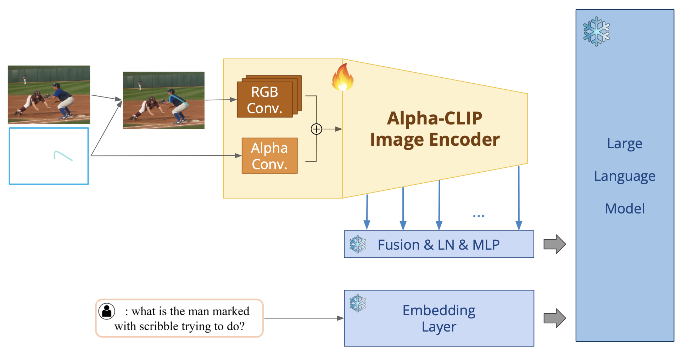

# Alpha-VIP-LLaVA

**🚧 This project is a modified and extended version of [ViP-LLaVA](https://github.com/WisconsinAIVision/ViP-LLaVA), incorporating key ideas from both **VIP-LLaVA** and **Alpha-CLIP** to improve multi-modal alignment and instruction-following capabilities.**



## 0. Overview 📌

**Alpha-VIP-LLaVA** is an enhanced multi-modal model built upon [VIP-LLaVA](https://arxiv.org/pdf/2312.00784) and [Alpha-CLIP](https://arxiv.org/pdf/2312.03818).  
It combines the strengths of both frameworks to improve visual–language alignment and representation quality:

- 📷 **VIP-LLaVA**: Integrates high-resolution visual prompts with the LLaVA architecture.  
- 🧠 **Alpha-CLIP**: Enhances CLIP features via attention-based feature discrimination for stronger feature separability and generalization.

This project fuses these approaches into a single, more powerful system for downstream vision–language tasks.

---

## 1. Installation 🔧

Make sure you have **Python 3.10+** installed. We recommend using a virtual environment (`venv` or `conda`).

```bash
git clone https://github.com/your-username/Alpha-VIP-LLaVA.git
cd Alpha-VIP-LLaVA

# If you use Poetry (pyproject.toml is provided):
pip install poetry
poetry install

# Or, install in editable mode with pip:
pip install -e .
```

## 2. Finetuning 🚀

We provide training scripts to finetune Alpha-VIP-LLaVA using your own dataset or publicly available vision–language datasets.

You can start finetuning by running:

```bash
bash scripts/finetune.sh

```


## 3. File Structure

```
Alpha-VIPLLAVA
├── llava
│   ├── eval
│   │   ├── table
│   │   └── webpage
│   ├── model
│   │   ├── language_model
│   │   ├── multimodal_encoder
│   │   └── multimodal_projector
│   ├── serve
│   │   └── examples
│   └── train
└── scripts
    └── eval

```

## 4. Citation 📜

If you use this work, please cite:

```
@misc{cai2024vipllavamakinglargemultimodal,
      title={ViP-LLaVA: Making Large Multimodal Models Understand Arbitrary Visual Prompts}, 
      author={Mu Cai and Haotian Liu and Dennis Park and Siva Karthik Mustikovela and Gregory P. Meyer and Yuning Chai and Yong Jae Lee},
      year={2024},
      eprint={2312.00784},
      archivePrefix={arXiv},
      primaryClass={cs.CV},
      url={https://arxiv.org/abs/2312.00784}, 
}

@misc{sun2023alphaclipclipmodelfocusing,
      title={Alpha-CLIP: A CLIP Model Focusing on Wherever You Want}, 
      author={Zeyi Sun and Ye Fang and Tong Wu and Pan Zhang and Yuhang Zang and Shu Kong and Yuanjun Xiong and Dahua Lin and Jiaqi Wang},
      year={2023},
      eprint={2312.03818},
      archivePrefix={arXiv},
      primaryClass={cs.CV},
      url={https://arxiv.org/abs/2312.03818}, 
}
```